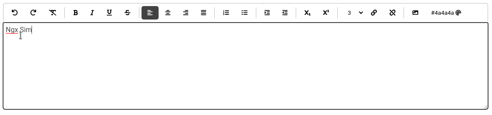

[](https://badge.fury.io/js/ngx-simple-text-editor)
[](https://ngx-simple-text-editor.netlify.app/)


[](https://circleci.com/gh/Raiper34/ngx-simple-text-editor)
[](https://coveralls.io/github/Raiper34/ngx-simple-text-editor?branch=main)
[](https://badge.fury.io/js/ngx-simple-text-editor)
[](https://www.jsdelivr.com/package/npm/ngx-simple-text-editor)
[](https://github.com/Raiper34/ngx-simple-text-editor)


# Ngx Simple Text editor
Ngx Simple Text editor or ST editor is a simple native text editor component for Angular 9+.
The key features of this editor are simplicity, cross-browser compatibility, and extensibility.




### Content
- [🔗 Compatibility](#-compatibility)
- [🚀 Instalation](#-instalation)
- [💻 Usage](#-usage)
- [✨ Demo](#-demo)
- [📖 License](#-license)


## 🔗 Compatibility
| Angular version | Ngx simple text editor version | Font awesome version |
|-----------------|--------------------------------|----------------------|
| 9 - 13          | 0.0.0 - 1.x.x                  | 5.0.0-6.x.x          |
| 14              | 2.x.x                          | 5.0.0-6.x.x          |
| 15              | 3.x.x                          | 5.0.0-6.x.x          |
| 16              | 4.x.x                          | 5.0.0-6.x.x          |
| 17              | 5.x.x                          | 5.0.0-6.x.x          |

# 🚀 Instalation

`npm install ngx-simple-text-editor --save`

then add `NgxSimpleTextEditorModule` into module imports
```typescript
import {NgxSimpleTextEditorModule} from 'ngx-simple-text-editor';

@NgModule({
// ...
  imports: [
    // ...
    NgxSimpleTextEditorModule,
    // ...
  ],
// ...
})
```
If you want to use default button icons, you must install Font awesome. 
`npm install @fortawesome/fontawesome-free` and declare in styles in angular.json
```json
...
"styles": [
  "src/styles.scss",
  "node_modules/@fortawesome/fontawesome-free/css/all.css"
]
...
```

# 💻 Usage
You can use Ngx simple text editor as classic template-driven form input or as reactive form input.
```angular2html
<st-editor [(ngModel)]="content" [config]="config"></st-editor>
```
The editor has got only one @Input with config object, which is optional.
The config object is defined by placeholder and buttons, both are optional and can be omitted.  
```typescript
import { Component } from '@angular/core';
import {EditorConfig, ST_BUTTONS} from 'ngx-simple-text-editor';

@Component({
  selector: 'app-root',
  templateUrl: './app.component.html',
  styleUrls: ['./app.component.scss']
})
export class AppComponent {
  content = '';
  config: EditorConfig = {
    placeholder: 'Type something...',
    buttons: ST_BUTTONS,
  };
}
```
You can pass all predefined buttons with predefined order, or you can use only buttons you want with order as you want.
```typescript
import {EditorConfig, UNDO_BUTTON, SEPARATOR, BOLD_BUTTON, ITALIC_BUTTON} from 'ngx-simple-text-editor';
...
config: EditorConfig = {
    buttons: [UNDO_BUTTON, SEPARATOR, BOLD_BUTTON, ITALIC_BUTTON],
  };
...
```

## Custom buttons
Defining custom buttons is really simple, you just need to create a new constant and pass it into the `buttons` property of the editor config.
The constant needs to consist of at least `type`, which is basically a type of button that will be rendered on the UI and `command`, which is an action, that will be performed.
You can use a predefined ExecCommand enum for command definition.
If you want to read more about exec commands, you can read [here](https://developer.mozilla.org/en-US/docs/Web/API/Document/execCommand).
Other required properties are derived from the given type and interfaces for all button types can be found [here](https://github.com/Raiper34/ngx-simple-text-editor/blob/main/projects/ngx-simple-text-editor/src/lib/models/button.ts).


For example, we can create our own custom button that adds preformatted and predefined strings into the editor.
We need to define a new button type of `EditorDropdown` because we want to pick one string from many and add it to the editor config
```typescript
import {EditorConfig, ExecCommand, Separator, ST_BUTTONS} from 'ngx-simple-text-editor';

export const CUSTOM: EditorDropdown = {
  type: ToolbarItemType.Dropdown, label: 'Custom', title: 'test custom', items: [
    {command: ExecCommand.insertHTML, value: '<b>This is bold<b>', label: 'Custom bold text'},
    {command: ExecCommand.italic, value: null, label: 'Make Italic'},
  ]
};

...
config: EditorConfig = {
    buttons: [...ST_BUTTONS, Separator, CUSTOM],
  };
...
```
Or we can create a button that prompts the user to write something and that string can be transformed and added into html.
Let's say, we want to input a button, where the user writes some string and we want to put it into the editor always bold
```ts
export const CUSTOM_INPUT: EditorInput =
  {
    type: ToolbarItemType.Input,
    command: ExecCommand.insertHTML,
    icon: 'fas fa-font',
    text: 'Create bold text',
    title: 'create bold text',
    transform: (val: string) => `<b>${val}</b>`
  };
```

The example of various default button types that have already been created in the editor and are the part of default config (full list [here](https://github.com/Raiper34/ngx-simple-text-editor/blob/main/projects/ngx-simple-text-editor/src/lib/constants/editor-buttons.ts)):
```ts
export const UNDO_BUTTON: EditorButton = {type: ToolbarItemType.Button, command: ExecCommand.undo, icon: 'fas fa-undo', title: 'undo'};
export const FORE_COLOR: EditorColor =
  {type: ToolbarItemType.Color, command: ExecCommand.foreColor, icon: 'fas fa-palette', title: 'font color'};
export const CUSTOM: EditorDropdown = {
  type: ToolbarItemType.Dropdown, label: 'Custom', title: 'test custom', items: [
    {command: ExecCommand.insertHTML, value: '<b>This is bold<b>', label: 'Custom bold text'},
    {command: ExecCommand.italic, value: null, label: 'Make Italic'},
  ]
};
export const LINK_INPUT: EditorInput =
  {type: ToolbarItemType.Input, command: ExecCommand.createLink, icon: 'fas fa-link', text: 'Create link', title: 'create link', label: 'Create link'};
export const UNLINK_BUTTON: EditorButton = {type: ToolbarItemType.Button, command: ExecCommand.unlink, icon: 'fas fa-unlink', title: 'unlink'};
export const FONT_SIZE_SELECT: EditorSelect = {
  type: ToolbarItemType.Select, command: ExecCommand.fontSize, title: 'font size', items: [
    {value: 1, label: '1'},
    {value: 2, label: '2'},
    {value: 3, label: '3'},
    {value: 4, label: '4'},
    {value: 5, label: '5'},
    {value: 6, label: '6'},
    {value: 7, label: '7'},
  ]
};
```

# ✨ Demo
[Online demo](https://ngx-simple-text-editor.netlify.app/)
or Stackblitz coming soon.

# 📖 License
MIT
