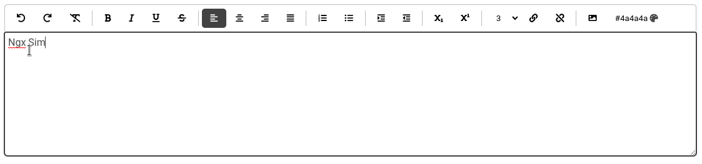

[](https://badge.fury.io/js/ngx-simple-text-editor)
[](https://ngx-simple-text-editor.netlify.app)


[](https://circleci.com/gh/Raiper34/ngx-simple-text-editor)
[](https://coveralls.io/github/Raiper34/ngx-simple-text-editor?branch=main)
[](https://badge.fury.io/js/ngx-simple-text-editor)
[](https://badge.fury.io/js/ngx-simple-text-editor)
[](https://badge.fury.io/js/ngx-simple-text-editor)
[](https://www.jsdelivr.com/package/npm/ngx-simple-text-editor)
[](https://github.com/Raiper34/ngx-simple-text-editor)


# Ngx Simple Text editor
Ngx Simple Text editor or ST editor is a simple native text editor component for Angular 9+.
The key features of this editor are simplicity, cross-browser compatibility, and extensibility.




### Content
- [🔗 Compatibility](#-compatibility)
- [🚀 Instalation](#-instalation)
- [💻 Usage](#-usage)
- [📚 Documentation and demos](#-documentation-and-demos)
- [📖 License](#-license)


## 🔗 Compatibility
| Angular version | Ngx simple text editor version | Font awesome version |
|-----------------|--------------------------------|----------------------|
| 9 - 13          | 0.0.0 - 1.x.x                  | 5.0.0-6.x.x          |
| 14              | 2.x.x                          | 5.0.0-6.x.x          |
| 15              | 3.x.x                          | 5.0.0-6.x.x          |
| 16              | 4.x.x                          | 5.0.0-6.x.x          |
| 17 - 19         | 5.x.x                          | 5.0.0-6.x.x          |

## 🚀 Instalation

`npm install ngx-simple-text-editor --save`

then add `NgxSimpleTextEditorModule` into module imports
```typescript
import {NgxSimpleTextEditorModule} from 'ngx-simple-text-editor';

@NgModule({
// ...
  imports: [
    // ...
    NgxSimpleTextEditorModule,
    // ...
  ],
// ...
})
```
If you want to use default button icons, you must install Font awesome. 
`npm install @fortawesome/fontawesome-free` and declare in styles in angular.json
```json
...
"styles": [
  "src/styles.scss",
  "node_modules/@fortawesome/fontawesome-free/css/all.css"
]
...
```

## 💻 Usage
You can use Ngx simple text editor as classic template-driven form input or as reactive form input.
```angular2html
<st-editor [(ngModel)]="content" [config]="config"></st-editor>
```
The editor has got only one @Input with config object, which is optional.
The config object is defined by placeholder and buttons, both are optional and can be omitted.  
```typescript
import { Component } from '@angular/core';
import {EditorConfig, ST_BUTTONS} from 'ngx-simple-text-editor';

@Component({
  selector: 'app-root',
  templateUrl: './app.component.html',
  styleUrls: ['./app.component.scss']
})
export class AppComponent {
  content = '';
  config: EditorConfig = {
    placeholder: 'Type something...',
    buttons: ST_BUTTONS,
  };
}
```

## 📚 Documentation and demos
[Online documentation and demos](https://ngx-simple-text-editor.netlify.app/)

# ⚖️ License
[MIT](https://choosealicense.com/licenses/mit/)
